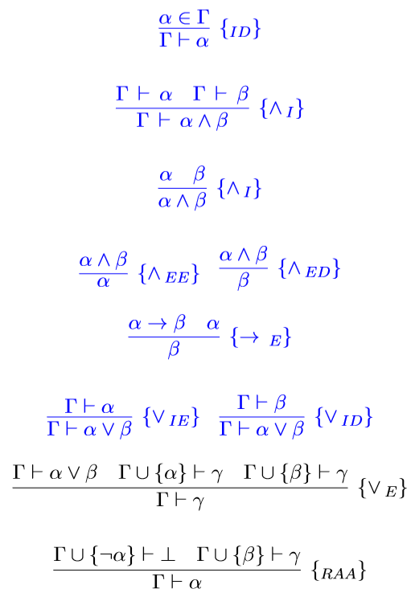

     

# Dedução natural Prolog

O presente repositório foi um trabalho acadêmico da disciplina Linguagens de Programação da UFOP, tendo objetivo de elaborar sistema de dedução natural na linguagem Prolog. O enunciado está disponível no root do repositório, existem erros e possibilidade de melhorias.

# Transcrição do enunciado e resolução

Um sistema de dedução natural é composto por um conjunto de regras de derivação que permite verificar se um dado sequente lógico é verdadeiro. As principais regras de dedução natural envolvendo os operadores são apresentadas a seguir:



Notes que nem todas as regras de derivação estão presentes, por exemplo, a regra de contradição e da redução ao absurdo. Todas as regras coloridas em azul já foram codificadas no arquivo fonte de exemplo fornecido com este enunciado. 

Sua tarefa é codificar o sistema de dedução apresentado em Prolog de modo que seja possível provar a corretude de um dado sequente lógico.

Optou-se por codificar o sistema de dedução natural pela codificação de contexto de prova denotado pelo functor **ctx(H, O)**, onde **H** é uma lista de fórmulas lógicas (o conjunto de hipóteses) e **O** é uma fórmula objetivo. Cada operador da lógica proposicional pode ser representado por um functor. A fórmula pode ser descrita como uma construção de functors. O seguinte sequente **A &#x2192; B, A &#x2228; B &#x22a2; B** pode ser representado pelo functor **ctx([imp(a, b), and(a, b)], b)**. Para maior conveniência o operador de negação pode ser implementado em termos da implicação usando a equivalência **&#xac;A &#x2261; A &#x2192;	&#x22a5;**.

As regras de dedução natural propriamente ditas são representadas por regras codificadas diretamente em prolog. 

Estas regras podem ser divididas em duas categorias: deduce e proof. A regra deduce sucede se uma dada formula pode ser obtida do contexto e compreende as regras de eliminação de operadores.

```prolog
deduce(ctx(H,A),['id']) :- member(A,H).
deduce(ctx(H,A),['and-ee']) :- member(and(A,_),H).
deduce(ctx(H,B),['and-ed']) :- member(and(_,B),H).
deduce(ctx(H,B),['imp-e','id'|R])  :- member(imp(A,B),H), deduce(ctx(H,A),R).
```

A regra proof tentar construir uma fórmula objetivo a partir do contexto e compreende a implementação das regras de introdução dos operadores.

```prolog
proof(done,[]).
proof(ctx(H,O),['id']) :- member(O,H).
proof(ctx(H,O),RS) :- deduce(ctx(H,O),RS).
proof(ctx(H,and(A,B)),['and-i'|R]) :- proof(ctx(H,A),RS),
                                      proof(ctx(H,B),RS1),
                                      append(RS,RS1,R).
                                      
proof(ctx(H,imp(A,B)),['intro-imp'|RS]) :- proof(ctx([A|H],B),RS).
proof(ctx(H,or(A,B)),['i-or'|RS]) :- proof(ctx(H,A),RS).
proof(ctx(H,or(A,B)),['i-or'|RS]) :- proof(ctx(H,B),RS).
```

Para implementar este trabalho realize as seguintes tarefas:

1. Implemente as regras que faltam no sistema.
* **RAA** - Redução ao Absurdo 
```prolog
proof(ctx(H,A),['RAA'|RS]) :- proof(ctx([imp(A,bot)|H],bot),RS).
```
* **&#x2228;E** - Eliminação Ou
```prolog
deduce(ctx(H,O),['or-e'|R]) :- member(or(A,B),H), proof(ctx([A|H],O),RS),
                                                  proof(ctx([B|H],O),RS1),
                                                  append(RS1,RS,R).
```
2. Existem algum exemplo de sequente que faz com que o programa entre em loop?
   1. `proof(ctx([], imp(a,a)),RS).`
   2. `proof(ctx([imp(imp(a,bot),a)], a), RS).`
3. Proponha uma melhoria que permita ao sistema provar sequentes como: **{(A &#x2192; B) &#x2192; C, A, B} 	&#x22a2; C**
```prolog
deduce(ctx(H,A),['id']) :- member(A,H).
deduce(ctx(H,A),['and-ee']) :- member(and(A,_),H).
deduce(ctx(H,B),['and-ed']) :- member(and(_,B),H).
deduce(ctx(H,B),['imp-e','id'|R])  :- member(imp(A,B),H), proof(ctx(H,A),R).
deduce(ctx(H,O),['or-e'|R]) :- member(or(A,B),H), proof(ctx([A|H],O),RS),
                                                  proof(ctx([B|H],O),RS1),
                                                  append(RS1,RS,R).

proof(done,[]).
proof(ctx(H,O),['id']) :- member(O,H).
proof(ctx(H,and(A,B)),['and-i'|R]) :- proof(ctx(H,A),RS),
                                      proof(ctx(H,B),RS1),
                                      append(RS,RS1,R).

proof(ctx(H,imp(A,B)),['intro-imp'|RS]) :- proof(ctx([A|H],B),RS).
proof(ctx(H,or(A,_)),['i-or'|RS]) :- proof(ctx(H,A),RS).
proof(ctx(H,or(_,B)),['i-or'|RS]) :- proof(ctx(H,B),RS).
proof(ctx(H,O),RS) :- deduce(ctx(H,O),RS).
proof(ctx(H,A),['RAA'|RS]) :- proof(ctx([imp(A,bot)|H],bot),RS).
```

# Licença

Este projeto está sob licença [MIT](https://choosealicense.com/licenses/mit/) © 2019 Vitor de Siqueira Cotta.

Para mais informações acesse o arquivo :scroll:LICENSE.md.

# Contato

:email: E-Mail: ​[vitorsiqueira95@outlook.com](vitorsiqueira95@outlook.com) 

:clipboard: Linkedin: ​[https://www.linkedin.com/in/vitor-de-siqueira-cotta-analista-de-sistemas/](https://www.linkedin.com/in/vitor-de-siqueira-cotta-analista-de-sistemas/)

:package: GitHub:  https://github.com/VitorDeSiqueiraCotta